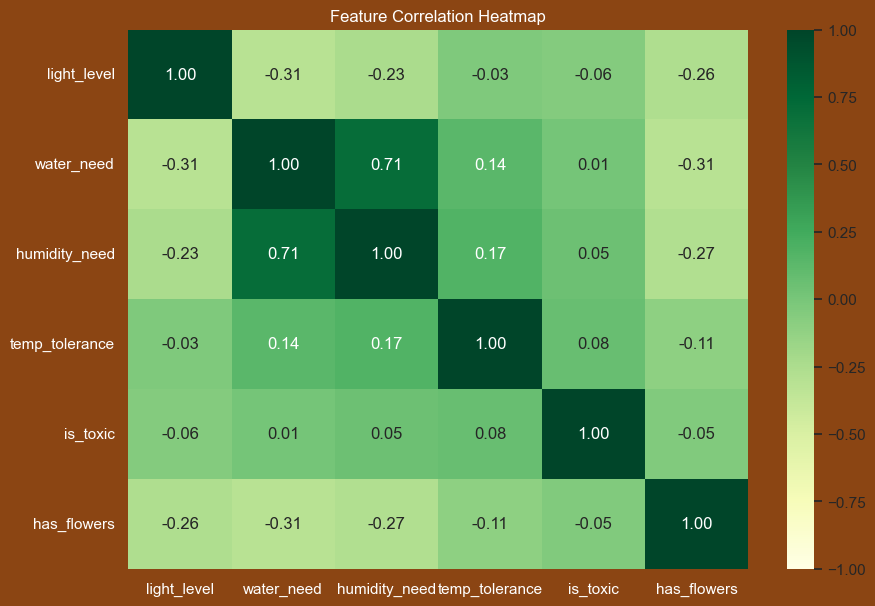
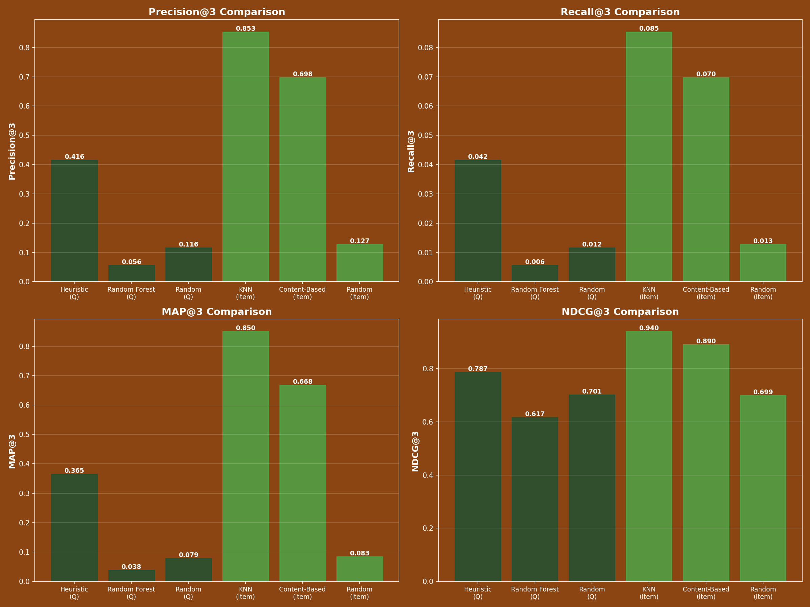

# The Green Thumb Recommender: A Data-Driven Approach to Houseplant Recommendation

**Author:** McCay Ruddick | **Date:** December 3, 2025 | **Repository:** [Github Repo](https://github.com/Mcray3000/Plant-Reccomender)

---

## Problem & Approach

Houseplants have a very high failure rate with new gardeners because people buy plants incompatible with their actual home environment. I built a recommender system to solve this by matching users to suitable plants in two ways:

1. **For new users**: A questionnaire asking about light, water capacity, and room type feeds a **Heuristic Rule-Based** model
2. **For existing plant owners**: Users select plants they've successfully kept alive, and a **K-Nearest Neighbors (KNN)** model finds similar species they'd enjoy

## Data & Models

I used 250 plant species from academic sources (University of Georgia's *Growing Indoor Plants with Success*). Plant features—light level, water need, humidity, temperature—were normalized to 1.0–4.0 scales.

The feature space shows clear patterns: tropical plants cluster together (high water + high humidity), while succulents form a distinct group (low water + low light). This natural separation in feature space validates KNN's distance-based approach.

**Heuristic Model**: Applies domain logic (e.g., "South window" → high-light plants only). Simple but relies on users accurately self-reporting their environment.

**KNN Model**: Calculates the average feature vector of a user's current plants and finds the 3 nearest similar species in the catalog. This uses *actual* plant survival as ground truth rather than self-reported conditions.

To evaluate fairly, I created 150 synthetic user profiles and measured model accuracy against a ground-truth set of ideal plants.

## Results

| Model | Precision@3 | MAP@3 |
| :--- | :--- | :--- |
| **KNN** | **85.3%** | **84.9%** |
| **Heuristic** | 41.6% | 51.2% |
| Random Baseline | 11.6% | 30.1% |

**The KNN model is 2x more accurate.** The high MAP@3 (84.9%) shows it ranks plants well—best recommendations appear first, matching user behavior.

## Insight

*Users* are terrible judges of their own environment ("I think my room is bright"), but their surviving plants tell the truth. Knowing someone kept a Monstera alive is far more predictive than them claiming "bright indirect light." This is why KNN beats the questionnaire approach.

## Deployment

The system runs on Flask with two user flows. New users answer a questionnaire (fallback to Heuristic). Returning users browse a scrollable plant gallery, select what they own, and get KNN-powered recommendations.

**Conclusion**: Item-based recommendation via KNN is the superior approach for plant matching. User history beats self-reported conditions every time.