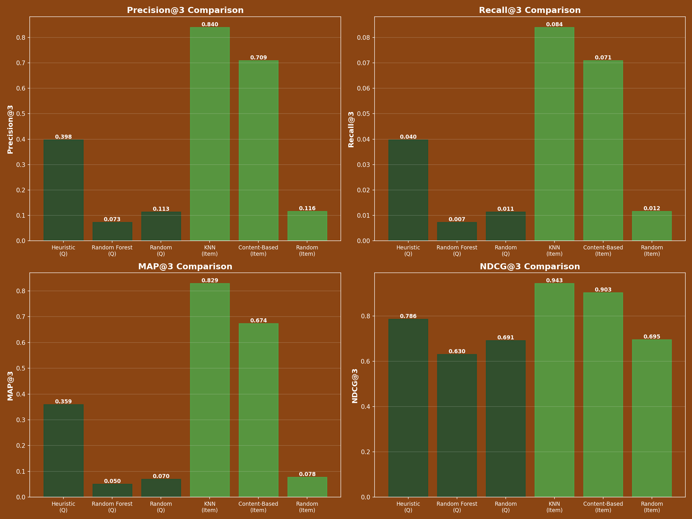

# First Draft of Final Project: Plant Recommender System

## 1. Objective
The objective of this project is to develop a nice Plant Recommender System that helps users find the perfect houseplants based on their specific environmental conditions (light, care, room type) or their existing plant preferences. This system aims to simplify the plant selection process, ensuring higher survival rates for plants and better satisfaction for users.

## 2. Modeling and Feature Development

### Feature Engineering
To build effective recommendation models, I processed the raw plant dataset to extract and normalize key features:
*   **Numerical Features**: `light_level`, `water_need`, `humidity_need`, `temp_tolerance`. These were normalized to a consistent scale (typically 1-3 or 1-4) to ensure fair weight distribution in distance calculations.
*   **Categorical Features**: `is_toxic`, `has_flowers`. These were converted to binary flags (0/1) to be used as hard filters or features in the models.
*   **User Input Mapping**: I developed a mapping system to translate user-friendly questionnaire inputs (e.g., "South facing window", "I forget to water") into the same numerical feature space as the plants, allowing for direct vector comparison.

### Models Implemented
I implemented and compared four distinct modeling approaches across two recommendation paradigms:

#### A. Questionnaire-Based Models (Cold Start)
These models recommend plants based on a user's answers to a lifestyle questionnaire.
1.  **Heuristic Recommender (Rule-Based)**:
    *   **Approach**: Applies a few strict filters based on user constraints (e.g., "Must be flowering") and then ranks remaining plants by how closely their light and care needs match the user's inputs.
    *   **Logic**: Uses explicit domain rules (e.g., South window = High Light).
2.  **Random Forest Classifier**:
    *   **Approach**: Treats recommendation as a classification problem. I created synthetic "difficulty clusters" (Easy, Medium, Hard) based on water and humidity needs and trained a Random Forest to predict the suitable cluster for a user.
    *   **Logic**: Learns non-linear relationships between environmental factors and plant suitability.

#### B. Item-Based Models (Collaborative/Content)
These models recommend plants similar to ones the user already owns and likes.
3.  **K-Nearest Neighbors (KNN)**:
    *   **Approach**: Calculates the average feature vector of a user's existing plants and finds the *k* nearest neighbors in the multi-dimensional feature space.
    *   **Logic**: "If you like plants A and B, you will like plant C which is close to them in feature space."
4.  **Content-Based Filtering (Cosine Similarity)**:
    *   **Approach**: Computes a cosine similarity matrix for all plants. For a user's plant list, it aggregates similarity scores to find the most similar unowned plants.
    *   **Logic**: Focuses on the angle between feature vectors, prioritizing the relative balance of features.

*A **Random Recommender** was also implemented as a baseline to validate that our models are performing better than random.*

## 3. Model Evaluation

### Methodology
To evaluate these models without live user data, I built a **synthetic evaluation eramework**:
*   **Synthetic Users**: Generated 150 simulated user profiles with randomized preferences (light, water, humidity).
*   **Ground Truth**: For each synthetic user, "perfect" matches were identified by calculating the Euclidean distance between their preference vector and all plants.
*   **Metrics**:
    *   **Precision@3**: The percentage of the top 3 recommendations that are relevant (in the ground truth set).
    *   **NDCG@3 (Normalized Discounted Cumulative Gain)**: Measures the quality of the ranking, giving higher scores when relevant items are placed at the top of the list.

### Results
The evaluation produced the following results:

| Model Type | Model Name | Precision@3 | NDCG@3 |
| :--- | :--- | :--- | :--- |
| **Questionnaire** | **Heuristic** | **0.398** | **0.786** |
| | Random Forest | 0.073 | 0.630 |
| | Random (Baseline) | 0.113 | 0.691 |
| **Item-Based** | **KNN** | **0.840** | **0.943** |
| | Content-Based | 0.709 | 0.903 |
| | Random (Baseline) | 0.116 | 0.695 |

### Visualizations
*   **3D UMAP Projection**: I generated an interactive 3D plot visualizing the plant feature space. This confirmed that plants with similar needs cluster together, and our KNN model effectively selects from these clusters.
[3D_Visualization HTML](evaluation_outputs/visualizations/umap_3d_visualization.html)
*   **Performance Charts**: Bar charts comparing Precision and NDCG clearly show the dominance of item-based models over the current questionnaire models.

## 4. Discussion

### Strengths & Weaknesses
*   **Strength**: The **KNN model** is exceptionally strong (Precision 84%, NDCG 94%), proving that if we know what plants a user likes, we can recommend new ones with high confidence.
*   **Strength**: The **Heuristic model** performs decently (Precision 40%) and is very explainable. It respects hard constraints (toxicity) perfectly, which is crucial for user trust.
*   **Weakness**: The **Random Forest model** performed poorly (worse than random in some metrics). This is likely because the synthetic "difficulty clusters" I created as training labels were too broad, losing the nuance needed for specific plant recommendations. It treated the problem as "predict the difficulty category" rather than "predict the specific best plant."

### Possible Sources of Error/Bias
*   **Synthetic Data Bias**: The evaluation relies on synthetic users with uniformly distributed preferences. Real users might cluster around specific common conditions (e.g., "Low light, low care"), which could skew real-world performance.
*   **Feature Weights**: Currently, all features (light, water, humidity) are weighted equally. In reality, `light_level` is likely a "harder" constraint than `humidity_need` for plant survival.

### Ideas for Final Report
1.  **Fun User Experience**: I would like to upgrade my CLI to something like a web app that is more entertaining and fun. I want this to be simmilar to how buzzfeed quizes look.
2.  **Weighted Features**: Experiment with weighting `light_level` higher in the KNN and Heuristic models to reflect its biological importance.
3.  **Hybrid Model**: Combine the Heuristic filter (to remove toxic/impossible plants) with the KNN ranking (to sort the remainder) for a "Best of Both Worlds" model.
4.  **Hyperparameter Tuning**: Optimize the `k` in KNN and the distance thresholds in the Heuristic model.
