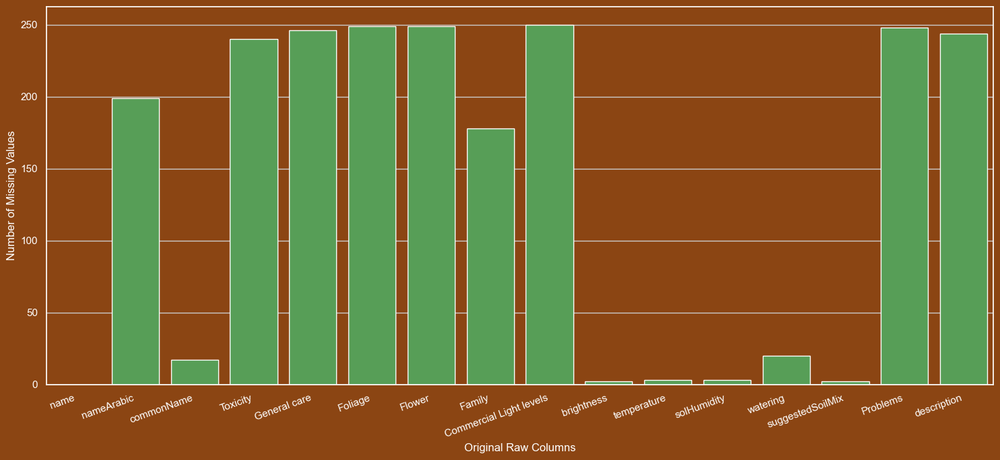
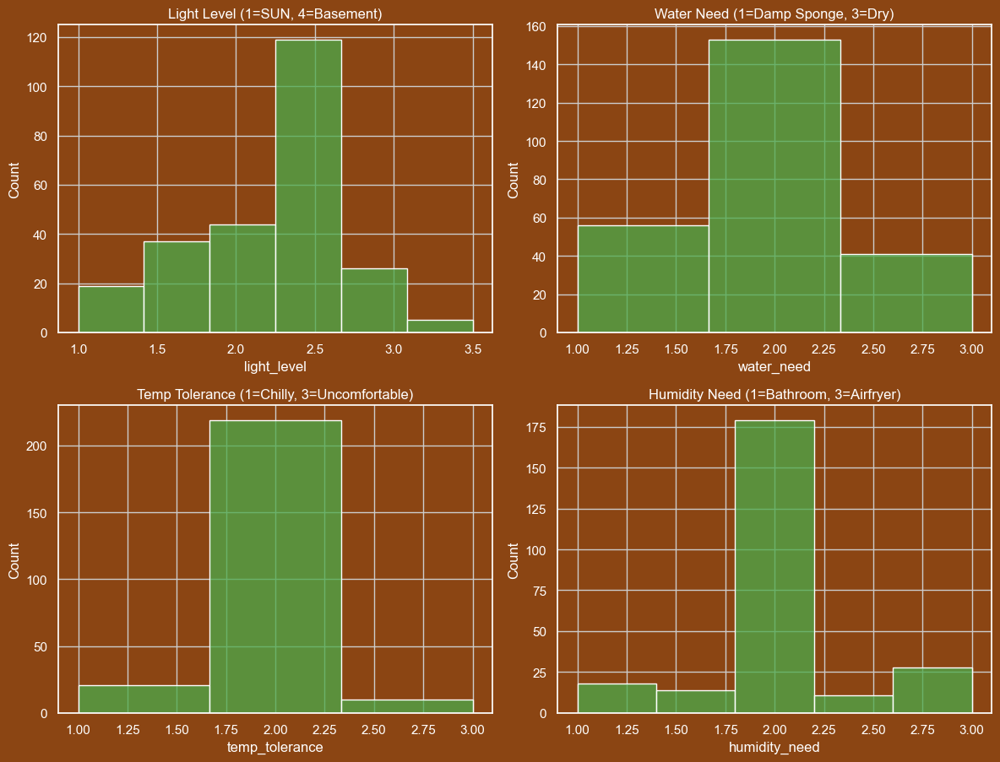
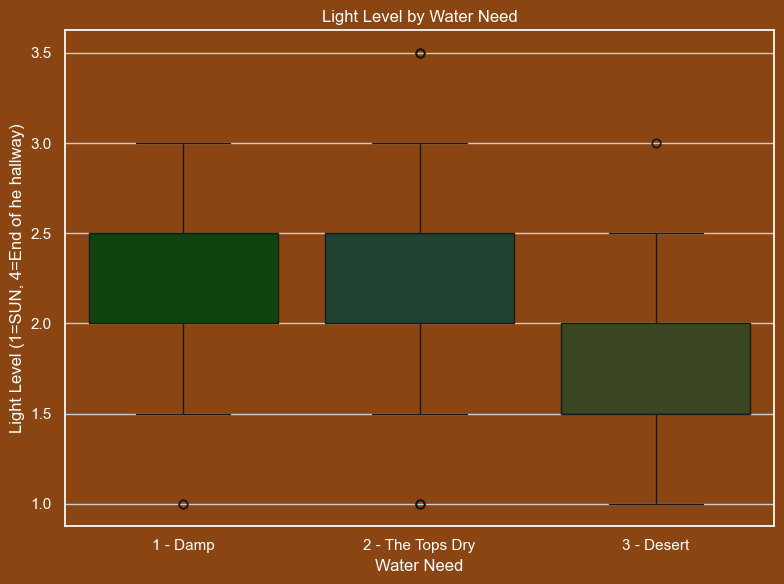

# McCays Houseplant Recommender

## 1. What is your dataset and why did you choose it?

**Dataset:** The dataset is the "Indoor plants DataSet" from Zenodo, which contains 250 distinct plant entries. It is based on academic research, primarily the "Growing Indoor Plants with Success" (B1318) publication from the University of Georgia.

**Why I Chose It:**
This dataset was selected as the foundation for my **houseplant recommender** for several reasons:

* **Data Quality & Bias:** Unlike blog posts or retail sites or all the other datasets I found, this dataset is based off of academic research. This makes it less biased by sales targets or personal opinions, providing a seemingly more "trustworthy" base for recommendations.

* **Feature Richness:** The raw data, while messy, contained the exact attributes needed for a preference-based recommender: `brightness` (light), `watering`, `solHumidity`, `temperature`, and `Toxicity`. These are the main factors I'll use to match my plant to their home environment.

* **Reasonable Scope:** With 250 entries, the dataset is large enough to provide a useful variety of recommendations but small enough to be thoroughly cleaned, analyzed, and managed for this project.

My goal is to build a recommender that can function in two ways:
1.  **Preference-to-Plant:** A user inputs their preferences (e.g., "low light, safe for pets"), and they get reccomended a plant.
2.  **Plant-to-Plant:** A user selects a plant(s) they like, and the reccomender finds other plants with the most similar attributes.

## 2. What did you learn from your EDA?

My EDA process was heavily focused on data cleaning and a little bit of feature engineering the raw data into a usable format for the recommender.

* **Significant Data Cleaning Was Required:** The primary finding was that the raw data was unusable in its original state. Key features like `light_level`, `humidity_need`, and `temp_tolerance` were stored as text or ranges (e.g., "1-3", "Bright indirect"). These all had to be standardized. There was lots of weirdness in the different representations of 1-3, 1,3, 1_3

* **Manual Features Were Needed:** Two main columns for a recommender were extremely sparse. `is_toxic` and `has_flowers` were almost entirely `NULL`. For has_flowers I place these features by manually mapping keywords (e.g., "Sansevieria," "Fern") from the `scientific_name` and `Family` columns to create 0/1 binary features. For this is_toxic I mapped assumed NULL is safe and trusted the ones marked as toxic, may need more review.

* **Key Distributions & Imbalance:**
    * The features are not uniformly distributed. Most plants in the dataset (avg 2.22) prefer **medium, indirect light**.
    * The `is_toxic` feature is **highly imbalanced**. Only 2% of the plants in the dataset are labeled as toxic (avg 0.02). I may drop it.

    

* **Relationships:**
    * The correlation heatmap revealed a some correlation between `light_level` and `water_need`. Also some much stronger correlations between `water_need` and `humidity`.
    

    * The boxplot confirmed this: high-light plants (like succulents, `light_level` = 1.0) are strongly associated with medium-to-low water needs (`water_need` = 2 or 3). This felt like it really validated my data, at least a little :)
    

## 3. What issues or open questions remain?

The EDA and cleaning process went well, but it also highlighted several challenges and open questions for building my recommender.

* **Issue: Text Feature Sparsity**
    The `description` and `General care` I wanted to just use as nice flavor text but they are almost entiely NULL so I may fill them in myself.

* **Issue: Class Imbalance**
    The `is_toxic` feature is very sketchy, I may do more for it manually but it will most likley be used as a filter if a user has pets or small children. 

* **Issue: Features for Plant Recommendations**
    I have lots of information now on how plants are similar and different plant needs. I also read the publication and learned a lot more about plants to add to what I learned in my Botany class. I still have to find a good answer to how to make a good plant reccomendation. I will also need to see about testing my reccomendations, I think I will do this by collecting the reccomendations and looking at pictures of them all together to manually evaluate it. I will come up with more later. I will need to work a lot to see what feature scaling makes sense for this as well in practice. Hopefully my opinion dosent bias it too much.

### Appendix: Feature Key

This key translates the numeric codes into their real-world definitions.

* **`light_level` (1.0 - 4.0)**
    * **1.0: Sunny** (At least 4 hours of direct sun)
        * **Window:** An unobstructed **South**, **South-West**, or **West** facing window.
    * **2.0: High** (Bright, but no direct sun; 200+ ft-c)
        * **Window:** A bright **East** window, or 3-5 feet back from a South/West window.
    * **3.0: Medium** (75 - 200 ft-c)
        * **Window:** A **North** window, or 5-10 feet back from a bright window.
    * **4.0: Low** (25 - 75 ft-c)
        * **Window:** A hallway, corner, or 10+ feet from a bright window.
    * *Note: Averaged values like **2.5** represent a range of tolerance (e.g., High to Medium).*
    

* **`water_need` (1 - 3)**
    * **1: High** (Keep soil mix moist)
    * **2: Average** (Surface of soil should dry before re-watering)
    * **3: Low** (Soil can become moderately dry before re-watering)

* **`humidity_need` (1 - 3)**
    * **1: High** (50% or higher; e.g., a bathroom or requires a humidifier)
    * **2: Average** (25% to 49%; typical for most homes)
    * **3: Low** (5% to 24%; tolerant of dry air)

* **`temp_tolerance` (1 - 3)**
    * **1: Cool** (50°F night, 65°F day)
    * **2: Average** (65°F night, 75°F day; standard indoor temps)
    * **3: Warm** (70°F night, 85°F day)
    * *Note: The dataset primarily contains "Cool" (1) and "Average" (2) plants.*